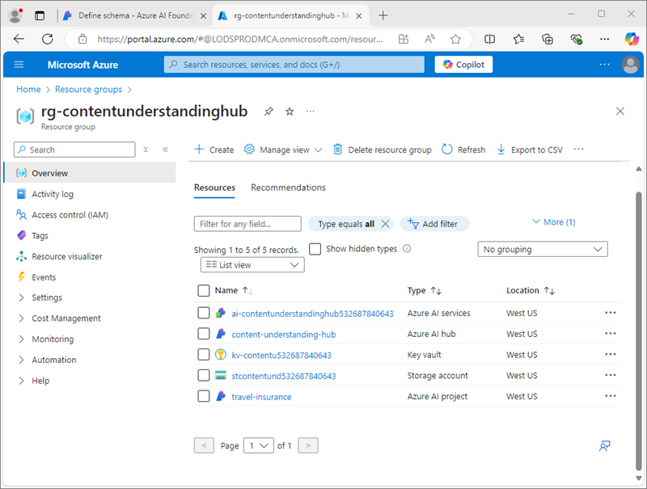

---
lab:
  title: Analizzare i contenuti con Comprensione del Contenuto di Azure AI
  module: Multimodal analysis with Content Understanding
---

# Analizzare i contenuti con Comprensione del Contenuto di Azure AI

In questo esercizio, viene utilizzato il Portale Azure AI Foundry per creare un progetto di comprensione dei contenuti in grado di estrarre informazioni dai moduli delle polizze assicurative di viaggio. Si testerà quindi l'analizzatore del contenuto nel Portale Fonderia Azure AI e lo si userà tramite l'interfaccia REST di comprensione dei contenuti.

Questo esercizio richiede circa **30** minuti.

## Creare un progetto di comprensione dei contenuti

Per iniziare, usare il portale Azure AI Foundry per creare un progetto di comprensione dei contenuti.

1. In un Web browser, aprire il [Portale Fonderia Azure AI](https://ai.azure.com) su `https://ai.azure.com` e accedere usando le credenziali di Azure.

    La home page del portale di Azure AI Foundry si presenta come l'immagine seguente:

    

1. Nella sezione **Ricerca rapida** della home page, nella parte inferiore, selezionare **Comprensione dei contenuti**.
1. Nella pagina **Comprensione dei contenuti** selezionare il pulsante **Crea nuovo progetto di comprensione dei contenuti**.
1. Nel passaggio **Panoramica del progetto** impostare le proprietà seguenti per il progetto, quindi selezionare **Avanti**:
    - **Nome progetto**: `travel-insurance`
    - **Descrizione**: `Insurance policy data extraction`
    - **Hub**: creare un nuovo hub
1. Nel passaggio **Crea un hub** impostare le proprietà seguenti e quindi selezionare **Avanti**:
    - **Risorsa dell'hub di Azure per intelligenza artificiale**: `content-understanding-hub`
    - **Sottoscrizione di Azure**: *selezionare la sottoscrizione di Azure*
    - **Gruppo di risorse**: *creare un nuovo gruppo di risorse con un nome univoco*
    - **Posizione**: *selezionare una delle posizioni disponibili*
    - **Servizi di Azure AI**: *creare una nuova risorsa dei Servizi di Azure AI con un nome appropriato*
1. Nel passaggio **Impostazioni di archiviazione** specificare un nuovo account di archiviazione dell'hub IA e selezionare **Avanti**.
1. Nella pagina **Rivedi** selezionare **Crea progetto**. Attendere quindi che il progetto e le relative risorse vengano create.

    Quando il progetto è pronto, verrà aperto nella pagina **Definisci schema**.

    

## Verificare le risorse di Azure

Quando è stato creato l'hub IA e il progetto, sono state create varie risorse nella sottoscrizione di Azure per supportare il progetto.

1. In una nuova scheda del browser, aprire il [portale di Azure](https://portal.azure.com) su `https://portal.azure.com`, accedendo con le credenziali di Azure.
1. Passare al gruppo di risorse creato per l'hub e notare le risorse di Azure create.

    

## Definire uno schema personalizzato

Si creerà un analizzatore in grado di estrarre informazioni dai moduli di assicurazione di viaggio. Si inizierà definendo uno schema basato su un modulo di esempio.

1. Scaricare il modulo di esempio [train-form.pdf](https://github.com/microsoftlearning/mslearn-ai-document-intelligence/raw/main/Labfiles/05-content-understanding/forms/train-form.pdf) da `https://github.com/microsoftlearning/mslearn-ai-document-intelligence/raw/main/Labfiles/05-content-understanding/forms/train-form.pdf` e salvarlo in una cartella locale.
1. Tornare alla scheda del browser contenente il progetto di comprensione dei contenuti e nella pagina **Definisci schema** caricare il file **train-form.pdf** appena scaricato.
1. Selezionare il modello di **analisi dei documenti** e quindi selezionare **Crea**.

    L'editor dello schema consente di definire i campi dati da estrarre dal modulo, visualizzato a destra. Il modulo è simile al seguente:

    

    I campi dati nel modulo sono costituiti da:
    
    - Raccolta di dettagli personali relativi al titolare della polizza.
    - Raccolta di dettagli relativi al viaggio per il quale è richiesta l'assicurazione.
    - Firma e data

    Si inizierà aggiungendo un campo che rappresenta i dettagli personali in forma di tabella, in cui verranno quindi definiti i sottocampi per i singoli dettagli.

1. Selezionare **+Aggiungi nuovo campo** e creare un nuovo campo con i valori seguenti:
    - **Nome campo**: `PersonalDetails`
    - **Descrizione campo**: `Policyholder information`
    - **Tipo valore**: tabella
1. Selezionare **Salva modifiche** (&#10004;) e notare che viene creato automaticamente un nuovo sottocampo.
1. Configurare il nuovo sottocampo con i valori seguenti:
    - **Nome campo**: `PolicyholderName`
    - **Descrizione campo**: `Policyholder name`
    - **Tipo valore**: stringa
    - **Metodo**: estrarre
1. Usare il pulsante **+ Aggiungi nuovo sottocampo** per aggiungere i sottocampi aggiuntivi seguenti:

    | Nome del campo | Descrizione campo | Tipo di valore | metodo |
    |--|--|--|--|
    | `StreetAddress` | `Policyholder address` | String | Estrazione |
    | `City` | `Policyholder city` | String | Estrazione |
    | `PostalCode` | `Policyholder post code` | String | Estrazione |
    | `CountryRegion` | `Policyholder country or region` | String | Estrazione |
    | `DateOfBirth` | `Policyholder birth date` | Data | Estrazione |

1. Dopo aver aggiunto tutti i sottocampi dei dettagli personali, usare il pulsante **Indietro** per tornare al livello superiore dello schema.
1. Aggiungere un nuovo campo *tabella* denominato **`TripDetails`** per rappresentare i dettagli del viaggio assicurato. Aggiungere quindi i sottocampi seguenti:

    | Nome del campo | Descrizione campo | Tipo di valore | metodo |
    |--|--|--|--|
    | `DestinationCity` | `Trip city` | String | Estrazione |
    | `DestinationCountry` | `Trip country or region` | String | Estrazione |
    | `DepartureDate` | `Date of departure` | Data | Estrazione |
    | `ReturnDate` | `Date of return` | Data | Estrazione |

1. Tornare al livello superiore dello schema e aggiungere i due campi individuali seguenti:

    | Nome del campo | Descrizione campo | Tipo di valore | metodo |
    |--|--|--|--|
    | `Signature` | `Policyholder signature` | String | Estrazione |
    | `Date` | `Date of signature` | Data | Estrazione |

1. Verificare che lo schema completato sia simile al seguente e quindi salvarlo.

    

1. Nella pagina **Test dell'analizzatore**, se l'analisi non inizia automaticamente, selezionare **Esegui analisi**. Attendere quindi il completamento dell'analisi ed esaminare i valori di testo nel modulo identificati come corrispondenti ai campi nello schema.

    

    Il servizio di comprensione dei contenuti deve aver identificato correttamente il testo che corrisponde ai campi nello schema. In caso contrario, è possibile usare la pagina **Dati etichetta** per caricare un altro modulo di esempio e identificare in modo esplicito il testo corretto per ogni campo.

## Creare e testare un analizzatore

Ora che è stato eseguito il training di un modello per estrarre campi dai moduli assicurativi, è possibile creare un analizzatore da usare con moduli simili.

1. Selezionare la pagina **Crea analizzatore** nel pannello di navigazione a sinistra.
1. Selezionare **+ Crea analizzatore** e creare un nuovo analizzatore con le proprietà seguenti (digitate esattamente come illustrato di seguito):
    - **Nome**: `travel-insurance-analyzer`
    - **Descrizione**: `Insurance form analyzer`
1. Attendere che il nuovo analizzatore sia pronto (usare il pulsante **Aggiorna** per controllare).
1. Scaricare [test-form.pdf](https://github.com/microsoftlearning/mslearn-ai-document-intelligence/raw/main/Labfiles/05-content-understanding/forms/test-form.pdf) da `https://github.com/microsoftlearning/mslearn-ai-document-intelligence/raw/main/Labfiles/05-content-understanding/forms/test-form.pdf` e salvarlo in una cartella locale.
1. Tornare alla pagina **Crea analizzatore** e selezionare il collegamento **travel-insurance-analyzer**. Verranno visualizzati i campi definiti nello schema dell'analizzatore.
1. Nella pagina **travel-insurance-analyzer** selezionare **Test**.
1. Usare il pulsante **+ Carica file di test** per caricare **test-form.pdf** ed eseguire l'analisi per estrarre i dati dei campi dal modulo di test.

    

1. Visualizzare la scheda **Risultato** per visualizzare i risultati in formato JSON restituiti dall'analizzatore. Nell'attività successiva verrà utilizzata l'API REST di comprensione dei contenuti per inviare un modulo all'analizzatore e restituire i risultati in questo formato.
1. Chiudere la pagina **travel-insurance-analyzer**.

## Usare l'API REST Comprensione dei contenuti

Dopo aver creato un analizzatore, è possibile usarlo da un'applicazione client tramite l'API REST di comprensione dei contenuti.

1. Passare alla scheda del browser contenente il portale di Azure (o aprire `https://portal.azure.com` in una nuova scheda se è stata chiusa).
1. Nel gruppo di risorse per l'hub di comprensione dei contenuti, aprire la risorsa di **Servizi di Azure AI**.
1. Nella sezione **Chiavi ed endpoint** sulla pagina **Panoramica**, visualizzare la scheda **Comprensione dei contenuti**.

    

    Sarà necessario l'endpoint di comprensione dei contenuti e una delle chiavi per connettersi all'analizzatore da un'applicazione client.

1. Usare il pulsante **[\>_]** a destra della barra di ricerca, nella parte superiore della pagina, per aprire una nuova sessione di Cloud Shell nel portale di Azure selezionando un ambiente ***PowerShell***. Cloud Shell fornisce un'interfaccia della riga di comando in un riquadro nella parte inferiore del portale di Azure, come illustrato di seguito:

    

    > **Nota**: se in precedenza è stata creata una sessione Cloud Shell che usa un ambiente *Bash*, passare a ***PowerShell***.

1. Si noti che è possibile ridimensionare Cloud Shell trascinando la barra di separazione nella parte superiore del riquadro o usando le icone **&#8212;**, **&#10530;** e **X** nell'angolo in alto a destra del riquadro per ridurre a icona, ingrandire o chiudere il riquadro. Per altre informazioni sull'uso di Azure Cloud Shell, vedere la [documentazione su Azure Cloud Shell](https://docs.microsoft.com/azure/cloud-shell/overview).
1. Nella barra degli strumenti di Cloud Shell scegliere **Vai alla versione classica** dal menu **Impostazioni**. Questa operazione è necessaria per usare l'editor di codice.

1. Nel riquadro PowerShell immettere i comandi seguenti per clonare il repository GitHub per questo esercizio:

    ```
    rm -r mslearn-ai-doc -f
    git clone https://github.com/microsoftlearning/mslearn-ai-document-intelligence mslearn-ai-doc
    ```

1. Dopo aver clonato il repository, passare alla cartella **mslearn-ai-doc/Labfiles/05-content-understanding/code**:

    ```
    cd mslearn-ai-doc/Labfiles/05-content-understanding/code
    ```

1. Immettere il comando seguente per modificare il file di codice Python **analyze_doc.py** fornito:

    ```
    code analyze_doc.py
    ```
    Il file di codice Python viene aperto in un editor di codice:

    

1. Nel file di codice sostituire il segnaposto **\<CONTENT_UNDERSTANDING_ENDPOINT\>** con l'endpoint di comprensione dei contenuti e il segnaposto **\<CONTENT_UNDERSTANDING_KEY\>** con una delle chiavi per la risorsa di Servizi di Azure AI.

    > **Suggerimento**: è necessario ridimensionare o ridurre a icona la finestra di Cloud Shell per copiare l'endpoint e la chiave dalla pagina della risorsa di Servizi di Azure AI nel portale di Azure. Prestare attenzione a non *chiudere* Cloud Shell, altrimenti occorrerà ripetere i passaggi precedenti.

1. Dopo aver sostituito i segnaposto, usare il comando **CTRL+S** per salvare le modifiche e quindi esaminare il codice completato, che:
    - Invia una richiesta HTTP POST all'endpoint di comprensione dei contenuti, indicando a **travel-insurance-analyzer** di analizzare un modulo in base al relativo URL.
    - Controlla la risposta dell'operazione POST per recuperare un ID per l'operazione di analisi.
    - Invia ripetutamente una richiesta HTTP GET al servizio di comprensione dei contenuti fino a quando l'operazione non è più in esecuzione.
    - Se l'operazione ha avuto esito positivo, visualizza la risposta JSON.
1. Usare il comando **CTRL+Q** per chiudere l'editor di codice mantenendo aperta la riga di comando di Cloud Shell.
1. Nel riquadro della riga di comando di Cloud Shell immettere il comando seguente per installare la libreria delle **richieste** Python (usata nel codice):

    ```
    pip install requests
    ```

1. Dopo aver installato la libreria, nel riquadro della riga di comando di Cloud Shell immettere il comando seguente per eseguire il codice Python:

    ```
    python analyze_doc.py
    ```

1. Esaminare l'output del programma, che include i risultati JSON dell'analisi del documento.

    > **Suggerimento**: il buffer dello schermo nella console di Cloud Shell potrebbe non essere sufficientemente grande da visualizzare l'intero output. Se si vuole esaminare l'intero output, eseguire il programma usando il comando `python analyze_doc.py > output.txt`. Al termine del programma, usare quindi il comando `code output.txt` per aprire l'output in un editor di codice.

## Eseguire la pulizia

Al termine del lavoro con il servizio di comprensione dei contenuti, è necessario eliminare le risorse create in questo esercizio per evitare di incorrere in costi di Azure non necessari.

1. Nel Portale Fonderia Azure AI passare al progetto **travel-insurance** ed eliminarlo.
1. Nel portale di Azure eliminare il gruppo di risorse creato in questi esercizi.

